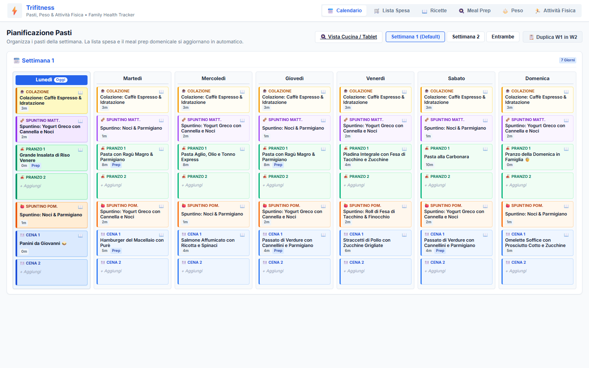
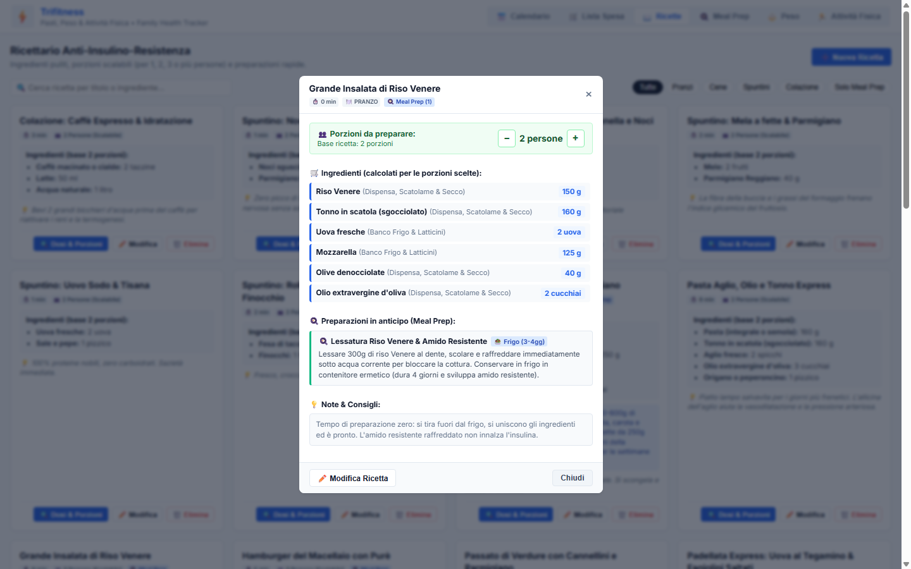
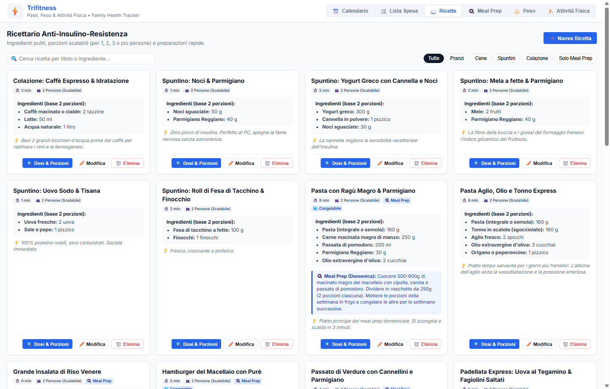
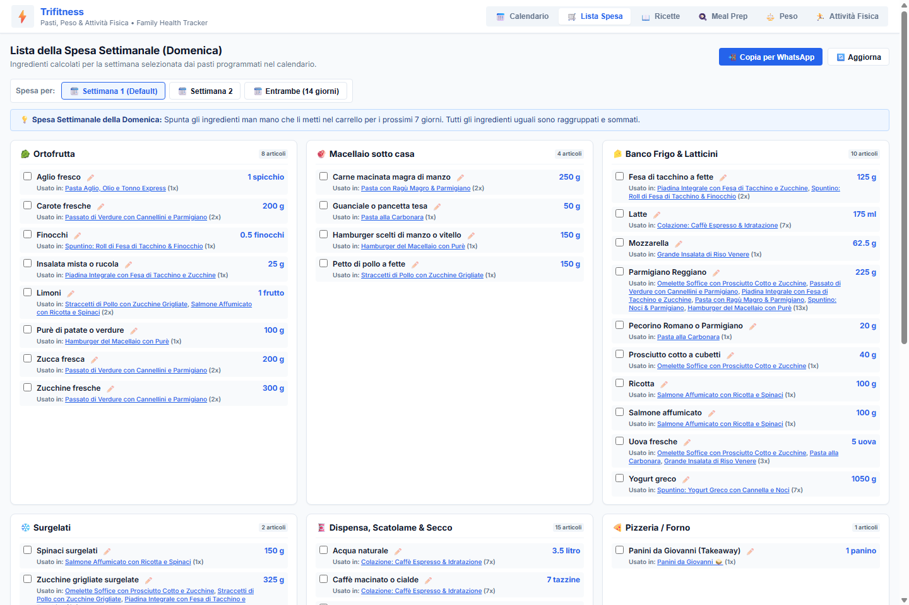
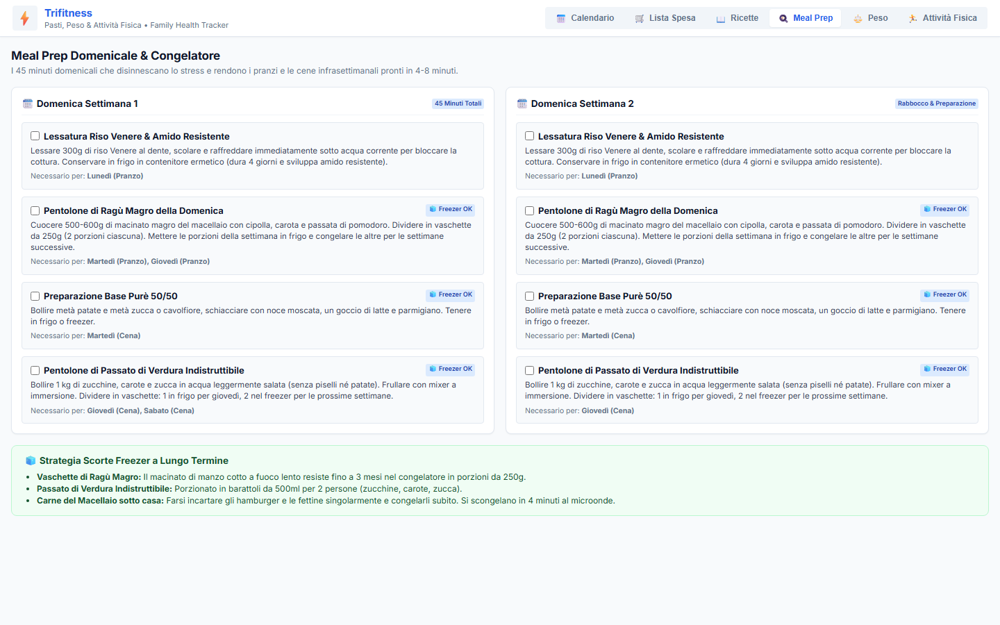
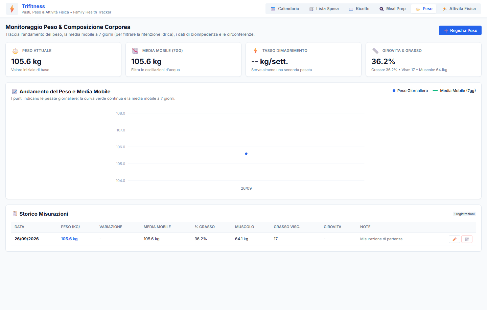
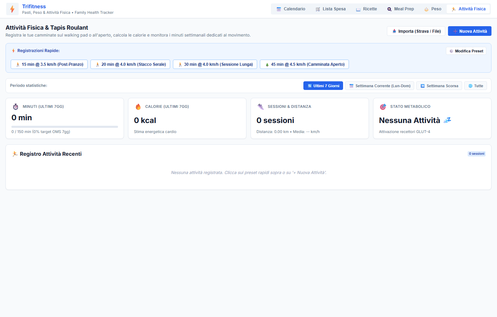
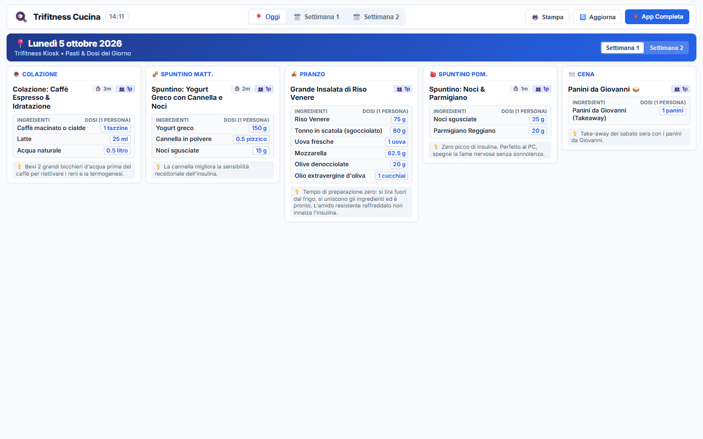
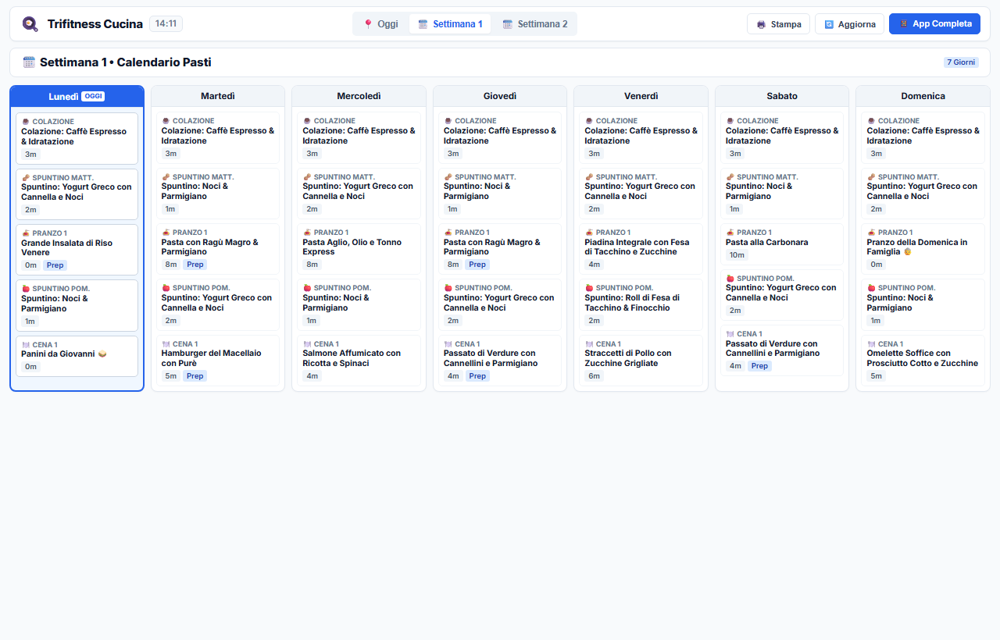

# ⚡ Trifitness
*(Precedentemente Metabolic Meal Planner)*

Applicazione web self-hosted, leggera e reattiva, progettata per il monitoraggio integrato della salute metabolica: pianificazione dei pasti familiari, generazione automatica della lista spesa per reparti, meal prep, tracciamento del peso con media mobile e bioimpedenza, e registro attività fisica con stima calorie per tapis roulant / walking pad.

Ideata per girare senza sforzo su home server Linux (Docker) con persistenza pura su file JSON (zero configurazioni complesse di database).



---

## 🚀 Caratteristiche Principali

### 1. 📅 Calendario Pasti Settimanale
* **Vista Settimanale (Default 7 giorni):** Visualizzazione compatta e leggibile, con possibilità di passare alla Settimana 2 o vedere entrambe le settimane contemporaneamente.
* **Allineamento Orizzontale Perfetto:** Le 5 fasce orarie dei pasti sono allineate al pixel su tutti i giorni per una scansione visiva immediata:
  * ☕ **Colazione** (Tonalità ambra/alba)
  * 🥜 **Spuntino Mattina** (Tonalità lavanda delicato)
  * 🍝 **Pranzo** (Tonalità verde mediterraneo)
  * 🍎 **Spuntino Pomeriggio** (Tonalità pesca/arancio)
  * 🍽️ **Cena** (Tonalità blu notte rilassante)
* **Duplicazione Rapida:** Tasto rapido *"📋 Duplica W1 in W2"* per clonare l'intera settimana con un clic.
* **Pulsante Ricetta Veloce (`📖`):** Ogni slot pasto ha un'icona diretta per aprire la scheda ricetta completa con le relative dosi ricalcolate.

---

### 2. 👥 Moltiplicatore Dinamico delle Porzioni & Ricettario
* Scheda di lettura dedicata per ciascun piatto con note metabolico-nutrizionali.
* **Stepper Interattivo `[-] [ X persone ] [+]`:** Permette di cucinare solo per 1 persona, per 2, per 3 o per l'intera famiglia.
* Tutte le grammature degli ingredienti si ricalcolano e si moltiplicano istantaneamente in tempo reale.
* **Ricettario Anti-Insulino-Resistenza:** Archivio con tempi di preparazione, filtri per portata, badge per basi congelabili/prep e ricerca per ingredienti usati.





---

### 3. 🛒 Lista della Spesa Intelligente (Spesa della Domenica)
* **Calcolo Settimanale:** Di default calcola la spesa per i 7 giorni successivi (oppure per entrambe le settimane).
* **Raggruppamento e Somma Automatica:** Tutti gli ingredienti identici tra ricette diverse vengono aggregati e sommati in un'unica riga.
* **Suddivisione per Reparto del Supermercato:**
  * 🥬 *Ortofrutta*
  * 🥩 *Macellaio sotto casa*
  * 🧀 *Banco Frigo & Latticini*
  * ❄️ *Surgelati*
  * 🥫 *Dispensa, Scatolame & Secco*
  * 🍕 *Pizzeria / Forno*
* **Link Interattivi:** Ogni ingrediente mostra i badge cliccabili delle ricette in cui è utilizzato (*"Usato in: ..."*).
* **Ridenominazione Globale Ingredienti:** Modifica rapida del nome ingrediente con propagazione automatica su tutte le ricette correlate.
* **📲 Condivisione WhatsApp in 1 Clic:** Formatta l'intera lista della spesa divisa per reparti con emoji e la copia negli appunti pronta da incollare in chat.



---

### 4. 🍳 Meal Prep Domenicale & Gestione Freezer
* Rilevamento automatico delle basi da preparare la domenica (ragù, cereali lessati per amido resistente, passati di verdura, uova sode).
* Distinzione chiara tra preparazioni da tenere in frigo per la settimana e vaschette destinate al congelatore a lungo termine.



---

### 5. ⚖️ Monitoraggio Peso & Composizione Corporea
* **Tracciamento Peso & Media Mobile (7gg):** Algoritmo integrato che calcola la media mobile per smussare le fluttuazioni d'acqua e mostrare il reale andamento del dimagrimento.
* **Stima Tasso di Dimagrimento:** Calcolo automatico del ritmo settimanale (kg/settimana) con indicazione dello stato rispetto al target sano (0.5 - 1.0 kg/sett.).
* **Grafico SVG Interattivo:** Rappresentazione grafica vettoriale leggera e offline (zero CDN o librerie esterne) con griglia e tooltip dettagliati al passaggio del mouse.
* **Supporto Bioimpedenza & Misure:** Campi opzionali per % massa grassa, massa muscolare (kg), livello grasso viscerale, % idratazione, girovita e fianchi (cm).



---

### 6. 🏃 Attività Fisica & Tapis Roulant / Walking Pad
* **Preset Rapidi in 1 Clic:** Pulsanti dedicati per sessioni standard (*15 min @ 3.5 km/h Post-Pranzo*, *20 min @ 4.0 km/h Stacco Serale*, *30 min @ 4.0 km/h Sessione Lunga*).
* **Stima Metabolica Automatica delle Calorie:** Calcolo energetico proporzionato in tempo reale al peso corporeo attuale e alla velocità media, con flag per disattivazione e inserimento manuale.
* **Barra di Avanzamento Obiettivo OMS:** Monitoraggio settimanale dei minuti di attività rispetto al target raccomandato di 150 minuti/settimana.
* **Predisposizione Multi-Attività & Sincronizzazione:** Supporto nativo per Walking Pad, camminata all'aperto, importazione file fitness (.tcx, .gpx, .fit) e sincronizzazione Strava.



---

### 7. 🍳 Vista Cucina & Kiosk Tablet (`/kitchen`)
Interfaccia read-only dedicata a tablet da cucina e schermi a parete (`/kitchen`, `/cucina`, `/tablet`), ottimizzata per consultazione rapida e modalità stampa:
* **Vista Giornaliera (Oggi):** Tutti i 5 momenti della giornata su una riga orizzontale pulita; ogni scheda riporta dosi e grammature già ricalcolate per il numero di porzioni del pasto, con supporto a piatti multipli (Pranzo 1 & 2, Cena 1 & 2) raggruppati armoniosamente.
* **Vista Settimanale (Week):** Calendario a 7 giorni compatto e pulito, pronto per la stampa su carta tramite il pulsante rapido `🖨️ Stampa`.
* **Auto-Aggiornamento in Background:** Si sincronizza periodicamente per riflettere le modifiche apportate dal PC o dallo smartphone.

#### Pasti e Ingredienti del Giorno (Oggi)


#### Calendario Settimanale Compatto per Tablet / Stampa


---

## 🐳 Avvio Rapido con Docker Compose

Il modo più semplice per eseguire l'applicazione è tramite Docker Compose (porta predefinita **9999**):

1. **Clona la repository:**
   ```bash
   git clone https://github.com/Trifase/trifitness.git
   cd trifitness
   ```

2. **Avvia il container:**
   ```bash
   docker compose up -d --build
   ```

3. **Apri il browser:**
   ```text
   http://localhost:9999
   # oppure http://<IP-DEL-TUO-SERVER>:9999
   ```

> **💾 Persistenza Dati:** La directory `./data/` è montata come volume all'interno del container. Qualsiasi modifica apportata tramite l'interfaccia web viene salvata direttamente nei file JSON locali (`data/recipes.json`, `data/plan.json`, `data/weight.json`, `data/activities.json`), rendendo backup e migrazioni facilissimi (`cp -r data/ backup/`).

---

## 💻 Esecuzione Locale (Senza Docker)

Requisiti: Python 3.10+

```bash
# Installa le dipendenze
pip install -r requirements.txt

# Avvia l'applicazione
python main.py
```

L'applicazione risponderà all'indirizzo `http://localhost:9999`.

---

## 🛠️ Stack Tecnologico

* **Backend:** [FastAPI](https://fastapi.tiangolo.com/) (Python) con [Uvicorn](https://www.uvicorn.org/).
* **Frontend:** Vanilla HTML5, CSS Grid / Flexbox moderno (senza framework pesanti, caricamento istantaneo).
* **Storage:** JSON File Store con Pydantic validation (portabile, versionabile, zero overhead).
* **Container:** Docker con immagine base `python:3.12-slim`.

---

## 📂 Struttura del Progetto

```text
trifitness/
├── data/
│   ├── recipes.json       # Database ricette con porzioni e ingredienti
│   ├── plan.json          # Stato del calendario dei pasti
│   ├── weight.json        # Storico misurazioni peso e bioimpedenza
│   └── activities.json    # Storico sessioni di attività fisica
├── docs/
│   └── screenshots/       # Screenshot dell'interfaccia utente
├── scripts/
│   └── capture_screenshots.py # Script headless per rigenerare gli screenshot
├── static/
│   ├── index.html         # Interfaccia grafica SPA principale
│   ├── kitchen.html       # Vista read-only Kiosk per tablet da cucina
│   ├── style.css          # Design responsive e colori delle sezioni
│   └── app.js             # Logica frontend (moltiplicatore, slot, spesa)
├── Dockerfile             # Definizione container Docker
├── docker-compose.yml     # Configurazione Docker Compose (porta 9999)
├── main.py                # API backend FastAPI
├── requirements.txt       # Dipendenze Python
└── README.md              # Documentazione del progetto
```

---

## 📄 Licenza

Rilasciato sotto licenza [MIT](LICENSE). Libero da usare, modificare e distribuire per uso personale o homelab.
